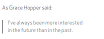
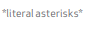
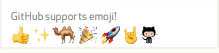
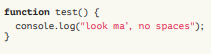
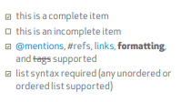
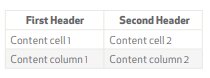

# Markdown Cheatsheet

## MARKDOWN SYNTAX
Markdown is a way to style text on the web.

### HEADERS
```
# This is an <h1> tag
## This is an <h2> tag
###### This is an <h6> tag
```

### LISTS
`Unordered`
```
* Item 1
* Item 2
 * Item 2a
 * Item 2b
```
`Ordered`
```
1. Item 1
2. Item 2
3. Item 3
 * Item 3a
 * Item 3b
```

### EMPHASIS
```
*This text will be italic*
_This will also be italic_
**This text will be bold**
__This will also be bold__
*You **can** combine them*
```

### BLOCKQUOTES
```
As Grace Hopper said:
> I’ve always been more interested
> in the future than in the past.
```

### IMAGES
```

```

### LINKS
```
[Text](url)
```

### BACKSLASH ESCAPES
Markdown allows you to use backslash escapes to generate literal characters which
would otherwise have special meaning in Markdown’s formating syntax.
```
\*literal asterisks\*
```

## GITHUB FLAVORED MARKDOWN
GitHub.com uses its own version of the Markdown syntax.

### USERNAME @MENTIONS

Typing an @ symbol, followed by a username, will notify that person to come and view the comment. This is called an “@mention”, because you’re mentioning the individual. You can also @mention teams within an organization.

### ISSUE REFERENCES
Any number that refers to an Issue or Pull Request will be automatically converted into a link.

```
#1
github-flavored-markdown#1
defunkt/github-flavored-markdown#1
```

### EMOJI

```
:+1: :sparkles: :camel: :tada:
:rocket: :metal: :octocat:
```

GitHub supports emoji!
To see a list of every image Github support, check out
www.emoji-cheat-sheet.com

### FENCED CODE BLOCKS
```javascript
function test() {
 console.log("look ma’, no spaces");
}
```

### TASK LISTS
```
- [x] this is a complete item
- [ ] this is an incomplete item
- [x] @mentions, #refs, [links](),
**formatting**, and <del>tags</del>
supported
- [x] list syntax required (any
unordered or ordered list
supported)
```

### TABLES
```
First Header | Second Header
------------ | -------------
Content cell 1 | Content cell 2
Content column 1 | Content column 2
```
